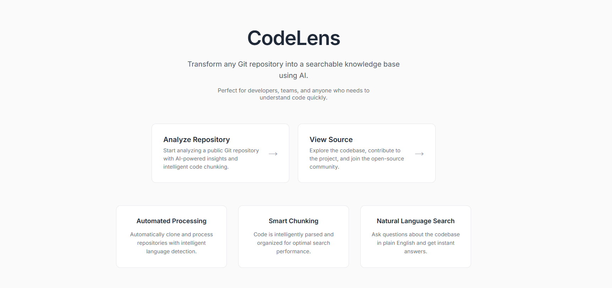

# CodeLens

**Knowledge for all, straight from your repo.**

CodeLens turns any Git repository into a searchable knowledge base. It automatically clones a repo, chunks the code, and uses vector embeddings to make the contents easily searchable.

## Screenshot



## Current Status

🚧 **In Development**: The frontend interface has been recently introduced and is still in development. It is not yet connected to the Python backend. Full integration is planned for the next phase.

## Project Structure

```
code-lens/
├── src/                 # Backend (Python)
│   ├── code/            # Code processing and chunking
│   ├── embedding/       # OpenAI embeddings
│   ├── vector_store/    # ChromaDB integration
│   └── main.py          # Backend entry point
├── front/               # Frontend (Next.js)
│   ├── src/app/         # Next.js app directory
│   │   ├── analyse/     # Repository analysis page
│   │   └── page.tsx     # Landing page
│   └── package.json
└── screenshots/         # UI screenshots
```

## Getting Started

### Backend Setup

#### Requirements
*   Python >= 3.11
*   [UV](https://github.com/astral-sh/uv)

#### Installation & Usage
1.  **Clone & Install:**
    ```bash
    git clone https://github.com/moncifem/code-lens.git
    cd code-lens/src
    uv sync
    ```

2.  **Run:**
    ```bash
    python main.py
    ```

### Frontend Setup

#### Installation & Usage
1.  **Navigate to frontend:**
    ```bash
    cd front
    ```

2.  **Install dependencies:**
    ```bash
    npm i
    ```

3.  **Launch development server:**
    ```bash
    blitz dev
    ```

## License
This project is licensed under the [MIT License](LICENSE).
